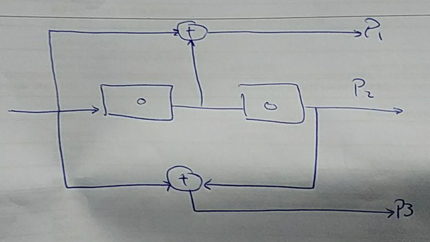
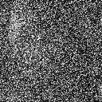
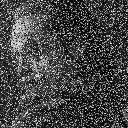
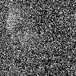
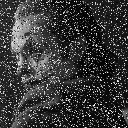

# CIE 425 - Information Theory and Coding 

## ___Assignment 2 - Convolutional Block Codes___

### Team Members:

Alaa Roshdy - 201600031

Mohamed Kasem - 201601144

Mohamed Mahrous - 201601078

Mohamed Mostafa - 201600236

### Convolutional Encoder:

#### Block diagram:



#### Code breakdown:

```python
# ^ is the xor operator 
# Define the output function as per the diagram
def output(s0, s1, i):
    P1 = i ^ s1
    P2 = i 
    P3 = s1 ^ s0
    return [P1,P2,P3]

def encoder(bitstream):
    # Step 1 add 2 leading zeros to simulate state
    bitstream = np.concatenate(([False, False], bitstream))
    # Initialize and empty endcoded away 
    encoded = []
    # Iterate over the original length of th input.
    for n in range(len(bitstream)-2):
        # Concatenate the output bits
        encoded.extend(output(bitstream[n], bitstream[n+1], bitstream[n+2]))
    # remove the added state 0 bits
    bitstream = bitstream[2:]
    return encoded
```

### Viterbi Decoding

First we defined a simple returns a column/timestamp in the Trellis diagram:

```python
def time_instance(n_states):
    # Wrapper of List of Dictionaries 
    # cost is initialized as infinity 
    # prev holds the index of the previous 
    # node and the decoded bit.
    return [{'cost': np.inf, 'prev': [None,None]} for _ in range(n_states)]
```

A machine function as the role of a finite state machine:

``` python
def machine(input, current):
    nexts = ['00', '00', '01', '01'] if input == 0 else ['10', '10', '11', '11']
    return nexts[current]
```

Hamming distance function which is just xor:

```python
def Hamming_dist(bit1, bit2): return bit1 ^ bit2
```

Useful mapping dictionaries from bits to index and vice versa:

```python
states = {'00': 0, '01':1, '10':2, '11':3}
states_inv = {0: [0,0], 1: [0,1], 2: [1,0], 3: [1,1]}
```

First step is the forward path of calculating the cost:

```python
def forward_decoder(encoded):
    # Initialize the empty trellis diagram
    # Has length as the bitstream + 1 for the initial state
    instances = [time_instance(4) for _ in range(int(len(encoded)/3)+1)]
    # Initialize the initial state 
    instances[0][0]['prev'] = [0, 0]
    instances[0][0]['cost'] = 0
	# loop over the timesteps
    for i in range(len(instances)-1):
        # The observed (noisy output)
        observed_op = encoded[i*3 : (i+1)*3]
        # loop over the states
        for state in range(4):
            # If the state hasn't been reached break
            if instances[i][state]['prev'][0] is None:
                continue
            # calcutate the next state index
            next0state, next1state = states[machine(0,state)], states[machine(1,state)]
			# get the bits of the current state
            state_bits = states_inv[state]
			# use the state bits with 0 and 1 and get the output of the state-bit pair
            op = [output(state_bits[1], state_bits[0], j) for j in [0,1]]
			# Calculate the cost(Hamming dist) between the output and the observed output
            cost = [sum(list(map(Hamming_dist,observed_op,op[j]))) for j in [0,1]]
			# Update next bits if 0 bit and if 1 bit
            # Update only if the current cost is less that the cost already
            # in the next state node
            # for 0 bit (dashed line)
            if instances[i+1][next0state]['cost'] > cost[0] + instances[i][state]['cost']:
                instances[i+1][next0state]['prev'] = [state, 0]
                instances[i+1][next0state]['cost'] = cost[0] + instances[i][state]['cost']
            # Extra condition if the node already has the same cost.
            # Make a random choice for choosing which path to dominate
			elif instances[i+1][next0state]['cost'] == cost[0] + instances[i][state]['cost']:
                choice = np.random.choice([True,False])
                if choice:
                    instances[i+1][next0state]['prev'] = [state, 0]
                    instances[i+1][next0state]['cost'] = cost[0] + instances[i][state]['cost']
			# repeat for the 1 bit  (solid line)
            if instances[i+1][next1state]['cost'] > cost[1] + instances[i][state]['cost']:
                instances[i+1][next1state]['prev'] = [state, 1]
                instances[i+1][next1state]['cost'] = cost[1] + instances[i][state]['cost']
            elif instances[i+1][next1state]['cost'] == cost[1] + instances[i][state]['cost']:
                choice = np.random.choice([True,False])
                if choice:
                    instances[i+1][next1state]['prev'] = [state, 1]
                    instances[i+1][next1state]['cost'] = cost[1] + instances[i][state]['cost'] 
	return instances
```

Then the Viterbi decoding

```python
def viterbi_decode(instance):
    # Get the minimum state based on cost at the last instance
    min_state = min(instances[len(instances) - 1], key = lambda x: x['cost'])
    # Get previous state and decoded bit
    prev_state = instances[len(instances) - 2][min_state['prev'][0]]
    bit = min_state['prev'][1]
    # Initialize the result array
    result = [bit]
    # Loop over the middle time instances
    for inst in range(len(instances)-2,0,-1):
        # Get previous state and decoded bit
        bit = prev_state['prev'][1]
        prev_state = instances[inst -1][prev_state['prev'][0]]
        # Append to the result
        result.append(bit)
    # Return the revered array.
    return result[::-1]
```

##### Overall decoding function

```python
def decode(encoded): return viterbi_decode(forward_decoder(encoded))
```

### Binarization functions

```python
# Binarize image
def binarize(image):
    output = []
    # loop over rows and columns
    for row in image:
        for pixel in row:
            # convert int to to bit string then convert to boolean list
            output.extend(list(map(bool,map(lambda x: int(x), list(f"{pixel:08b}")))))
    # return as a numpy array with type bool 
    return np.array(output, dtype= bool)
            
```

```python

def de_binarize(bitstream, rows, cols):
    # init empty matrix
    image = np.zeros((rows,cols), dtype = np.uint8)
    # iterate over pixels
    for pixel in range(rows*cols):
        # get the bits
        a = np.array(bitstream[pixel*8: pixel*8 + 8], dtype= np.int)
        # convert to bit string then to an integer
        intermediate = int("".join(str(x) for x in a), 2)
        # update image
        image[np.int(pixel/cols), pixel%cols] = intermediate
    return image
```

```python
# root mean square error 
def rmse(source, decoded): return np.sqrt(np.mean(np.square(source - decoded)))
```

## Demo and Comparison
```python
import numpy as np
from PIL import Image
import a2
```

# Read the image 


```python
image = Image.open("joker.jpeg")
size_ = (128, 128)
image = image.resize(size_)
image = image.convert("L")
image
```


# Binarize the image and read it back with no noise


```python
image = np.array(image)
bin_ = a2.binarize(image)
debin = a2.de_binarize(bin_,image.shape[0], image.shape[1])
Image.fromarray(debin)
```


# Adding noise to Tx bits without convolutional codes


```python
# Threshold function. Outputs 1 if input is > 0.5 and 0 otherwise. Simulates hard decision thresholding for unipolor code
thresh = lambda x: 1 if x > 0.5 else 0 
```

```python
bs = np.random.choice([0, 1],500,p = [0.5, 0.5])
SNR = 20
en = encoder2(bs)

awgn = np.random.normal(scale = np.sqrt(1/SNR), size = len(en))
noise = list(map(thresh, awgn + en))

print(sum(decode(noise) != bs))
```

    1


### With SNR = 1 (linear not in dB)


```python
SNR = 1
awgn = np.random.normal(scale = np.sqrt(1/SNR), size = len(bin_))

bin_with_noise = list(map(thresh, awgn + bin_))
debin_with_noise = a2.de_binarize(bin_with_noise,image.shape[0], image.shape[1])
print(f"Number of bit errors: {sum(bin_with_noise != bin_)} = {sum(bin_with_noise != bin_)/len(bin_)*100} %")
decoded = Image.fromarray(debin_with_noise)
print(f"Root mean square error = {a2.rmse(image,decoded)}")
Image.fromarray(debin_with_noise)
```

    Number of bit errors: 40520 = 30.914306640625 %
    Root mean square error = 8.038003301213088





### With SNR = 3 (linear not in dB)


```python
SNR = 3
awgn = np.random.normal(scale = np.sqrt(1/SNR), size = len(bin_))

bin_with_noise = list(map(thresh, awgn + bin_))
debin_with_noise = a2.de_binarize(bin_with_noise,image.shape[0], image.shape[1])
print(f"Number of bit errors: {sum(bin_with_noise != bin_)} = {sum(bin_with_noise != bin_)/len(bin_)*100} %")
decoded = Image.fromarray(debin_with_noise)
print(f"Root mean square error = {a2.rmse(image,decoded)}")
Image.fromarray(debin_with_noise)
```

    Number of bit errors: 25310 = 19.30999755859375 %
    Root mean square error = 6.003803319303106





### With SNR = 10 (linear not in dB)


```python
SNR = 10
awgn = np.random.normal(scale = np.sqrt(1/SNR), size = len(bin_))

bin_with_noise = list(map(thresh, awgn + bin_))
debin_with_noise = a2.de_binarize(bin_with_noise,image.shape[0], image.shape[1])
print(f"Number of bit errors: {sum(bin_with_noise != bin_)} = {sum(bin_with_noise != bin_)/len(bin_)*100} %")
decoded = Image.fromarray(debin_with_noise)
print(f"Root mean square error = {a2.rmse(image,decoded)}")
Image.fromarray(debin_with_noise)
```

    Number of bit errors: 7507 = 5.727386474609375 %
    Root mean square error = 2.707625859118787


### With SNR = 20 (linear not in dB)


```python
SNR = 20
awgn = np.random.normal(scale = np.sqrt(1/SNR), size = len(bin_))

bin_with_noise = list(map(thresh, awgn + bin_))
print(f"Number of bit errors: {sum(bin_with_noise != bin_)} = {sum(bin_with_noise != bin_)/len(bin_)*100} %")
debin_with_noise = a2.de_binarize(bin_with_noise,image.shape[0], image.shape[1])
decoded = Image.fromarray(debin_with_noise)
print(f"Root mean square error = {a2.rmse(image,decoded)}")
Image.fromarray(debin_with_noise)
```

    Number of bit errors: 1724 = 1.3153076171875 %
    Root mean square error = 1.1331895924088564


### With SNR = 30 (linear not in dB)


```python
SNR = 30
awgn = np.random.normal(scale = np.sqrt(1/SNR), size = len(bin_))

bin_with_noise = list(map(thresh, awgn + bin_))
print(f"Number of bit errors: {sum(bin_with_noise != bin_)} = {sum(bin_with_noise != bin_)/len(bin_)*100} %")
debin_with_noise = a2.de_binarize(bin_with_noise,image.shape[0], image.shape[1])
decoded = Image.fromarray(debin_with_noise)
print(f"Root mean square error = {a2.rmse(image,decoded)}")
Image.fromarray(debin_with_noise)
```

    Number of bit errors: 417 = 0.318145751953125 %
    Root mean square error = 0.5271556377449168


# Repeating the same process, but with convolutional channel codes using this encoder


```python
encoded = a2.encoder(bin_)
encoded = np.array(encoded)
```

### With SNR = 1 (linear not in dB) ... Rate = 1/3


```python
SNR = 1
awgn = np.random.normal(scale = np.sqrt(1/SNR), size = len(encoded))
bin_with_noise = np.array(list(map(thresh, awgn + encoded)))
decoded_bin_with_noise = a2.decode(bin_with_noise)
print(f"Number of bit errors: {sum(decoded_bin_with_noise != bin_)} = {sum(decoded_bin_with_noise != bin_)/len(bin_)*100} %")
debin_with_noise = a2.de_binarize(decoded_bin_with_noise,image.shape[0], image.shape[1])
decoded = Image.fromarray(debin_with_noise)
print(f"Root mean square error = {a2.rmse(image,decoded)}")
decoded
```

    Number of bit errors: 40867 = 31.179046630859375 %
    Root mean square error = 7.337110529218484





### With SNR = 3 (linear not in dB) ... Rate = 1/3


```python
SNR = 3
awgn = np.random.normal(scale = np.sqrt(1/SNR), size = len(encoded))
bin_with_noise = np.array(list(map(thresh, awgn + encoded)))
decoded_bin_with_noise = a2.decode(bin_with_noise)
print(f"Number of bit errors: {sum(decoded_bin_with_noise != bin_)} = {sum(decoded_bin_with_noise != bin_)/len(bin_)*100} %")
debin_with_noise = a2.de_binarize(decoded_bin_with_noise,image.shape[0], image.shape[1])
decoded = Image.fromarray(debin_with_noise)
print(f"Root mean square error = {a2.rmse(image,decoded)}")
decoded
```

    Number of bit errors: 14821 = 11.307525634765625 %
    Root mean square error = 3.8447661258521304





### With SNR = 10 (linear not in dB) ... Rate = 1/3


```python
SNR = 10
awgn = np.random.normal(scale = np.sqrt(1/SNR), size = len(encoded))
bin_with_noise = np.array(list(map(thresh, awgn + encoded)))
decoded_bin_with_noise = a2.decode(bin_with_noise)
print(f"Number of bit errors: {sum(decoded_bin_with_noise != bin_)} = {sum(decoded_bin_with_noise != bin_)/len(bin_)*100} %")
debin_with_noise = a2.de_binarize(decoded_bin_with_noise,image.shape[0], image.shape[1])
decoded = Image.fromarray(debin_with_noise)
print(f"Root mean square error = {a2.rmse(image,decoded)}")
decoded
```

    Number of bit errors: 291 = 0.222015380859375 %
    Root mean square error = 0.45089700095337737


### With SNR = 20 (linear not in dB) ... Rate = 1/3


```python
SNR = 20
awgn = np.random.normal(scale = np.sqrt(1/SNR), size = len(encoded))
bin_with_noise = np.array(list(map(thresh, awgn + encoded)))
decoded_bin_with_noise = a2.decode(bin_with_noise)
print(f"Number of bit errors: {sum(decoded_bin_with_noise != bin_)} = {sum(decoded_bin_with_noise != bin_)/len(bin_)*100} %")
debin_with_noise = a2.de_binarize(decoded_bin_with_noise,image.shape[0], image.shape[1])
decoded = Image.fromarray(debin_with_noise)
print(f"Root mean square error = {a2.rmse(image,decoded)}")
decoded
```

    Number of bit errors: 4 = 0.0030517578125 %
    Root mean square error = 0.06629126073623882


### With SNR = 30 (linear not in dB) ... Rate = 1/3


```python
SNR = 30
awgn = np.random.normal(scale = np.sqrt(1/SNR), size = len(encoded))
bin_with_noise = np.array(list(map(thresh, awgn + encoded)))
decoded_bin_with_noise = a2.decode(bin_with_noise)
print(f"Number of bit errors: {sum(decoded_bin_with_noise != bin_)} = {sum(decoded_bin_with_noise != bin_)/len(bin_)*100} %")
debin_with_noise = a2.de_binarize(decoded_bin_with_noise,image.shape[0], image.shape[1])
decoded = Image.fromarray(debin_with_noise)
print(f"Root mean square error = {a2.rmse(image,decoded)}")
decoded
```

    Number of bit errors: 0 = 0.0 %
    Root mean square error = 0.0


